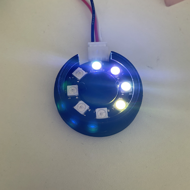

# CO2濃度センサ

M5StampC3 と Sensirion SCD30 を使ってCO2濃度の測定と警告を行います。  

Blog: https://hollyhockberry.hatenablog.com/entry/2022/01/16/190343 

## How to start

SCD30は SDA -> G1, SCL -> G0 に接続.

```platformio.ini``` の ```upload_port```を環境に合わせて修正し、platformIOでファームウェアを書き込みます。

```
pio run --target upload
```

うまく書き込めると5分おきにCO2濃度を測定し、測定値に応じた色でM5StampC3内蔵のLEDを点灯します。

| CO2濃度 | LED Color |
|---|---|
| GOOD (ppm <= 1000) | Green |
| BETTER (1000 < ppm <= 1500)| Yellow |
| BAD (1500 < ppm <= 2500) | Orange |
| TOO BAD (2500 < ppm) | Red |

## Advanced

設定を記述した```setting.json```をSPIFFSで書き込むとブート時に読み込んで動作をカスタマイズできます。

| Item | Key | default |
|---|---|---|
| 測定間隔(秒) | Interval | 300 |
| ログ間隔(秒) | PostInterval | 300 |
| LED COLOR (GOOD) | LED_Good | 0x008000 |
| LED COLOR (BETTER) | LED_Better | 0xffff00 |
| LED COLOR (BAD) | LED_Bad | 0xff4100 |
| LED COLOR (TOOBAD) | LED_TooBad | 0xff0000 |
| LED Port | LED_Pin | 2 | 
| Number of LED | LED_Num | 1 |

書き込みは

```
pio run --target uploadfs
```


## Logging

測定したデータをAmbientに送ることもできます。

WiFiの設定とAmbientのチャネルを```setting.json```に記述して指定します。

| Item | Key |
|---|---|
| SSID | SSID | 
| パスワード | PSK |
| AmbientチャネルID | Amb_ID |
| Ambientライトキー | Amb_KEY |

Ambientの使い方に関しては https://ambidata.io をご覧ください。

## 問題

LEDが中途半端な状態になる時がありました。発生頻度が低いので原因不明です。。。


